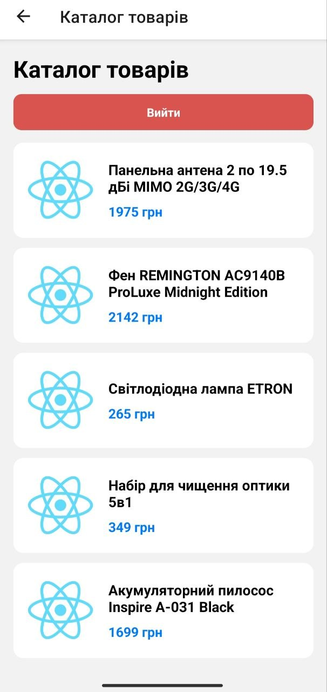
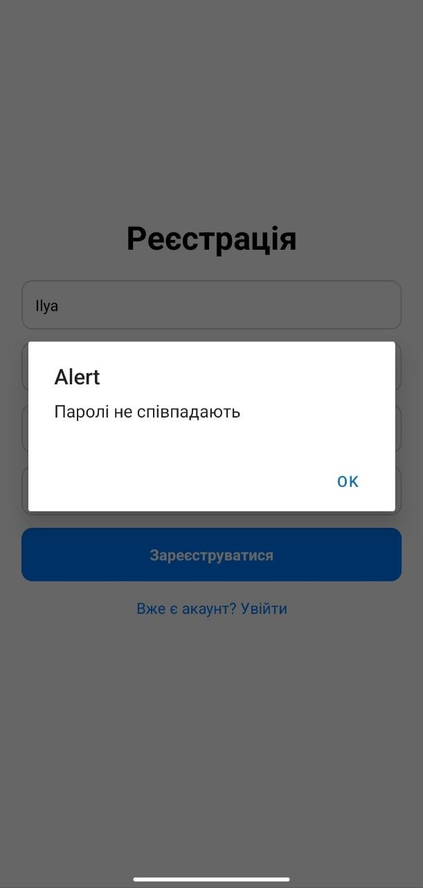
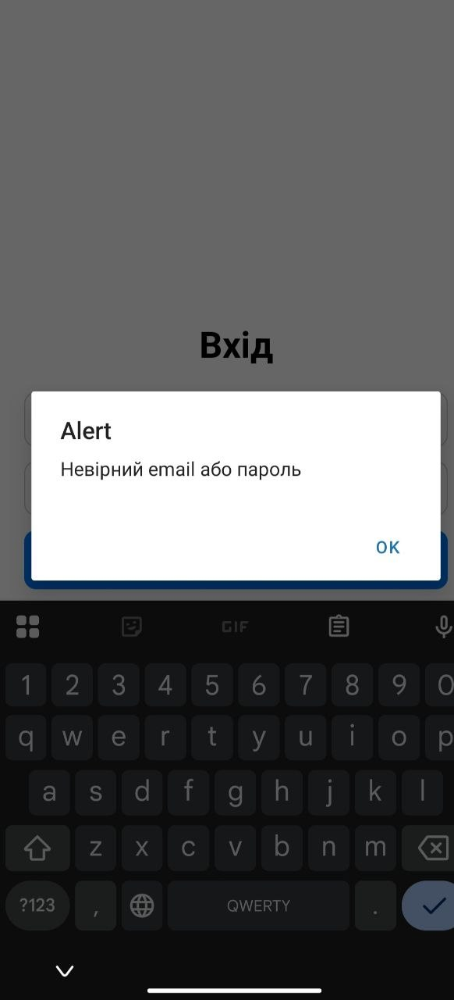
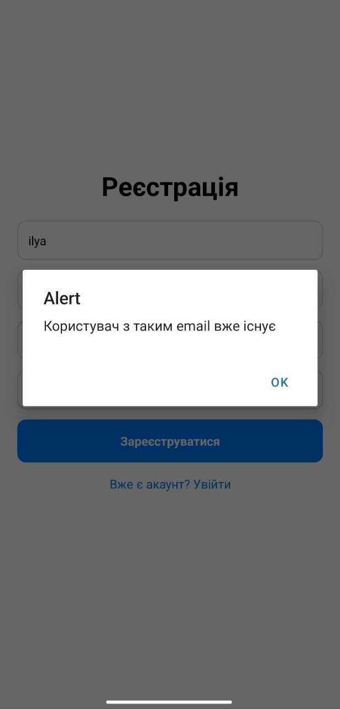

# Практична робота №5
## Виконав студент Кравцов І.М групи ІПЗ-22-3
1. Start the app

   ```bash
    npx expo start
   ```
### Демонстрація роботи додатку











1) Яким чином за допомогою Expo Router реалізуєтьсяперенаправлення неавторизованого користувача?
за допомогою компонента Redirect.Якщо користувач не авторизований, виконується перенаправлення на екран входу.
2) У чому полягає різниця між використанням компонента <Link>та метода router.push()?
Link використовується як компонент для переходу між екранами і може використовуватися на копках картах і тексті , а router.push() викликаеться після якоїсь логіки виконання.
3) Як працюють динамічні маршрути в Expo Router і як отриматипередані параметри?
Створюють універсальні екрани, які обробляють різні дані замість того, щоб створювати окремий файл для кожної сторінки.
4) Чому стан авторизації доцільно зберігати у глобальному контексті (React Context), а не в локальному стані компонента?
Тому що стан авторизації потрібен у різних частинах застосунку.React Context дозволяє зберігати цей стан глобально і не передавати його вручну  між компонентами.
5) Для чого використовуються групи маршрутів (folderName) і як вони впливають на URL-адресу?
Використовуються для логічної організації файлів у проєкті без зміни чи додавання символів до підсумкової URL-адреси,тому ніяк не впливають
